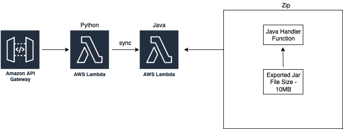

# symmetrical-octo-sniffle

## Project Structure

```bash
├── infrastucture
│   ├── README.md
│   ├── cdk.json
│   ├── pom.xml
│   └── src
│       ├── main
│       │   └── java
│       │       └── com
│       │           └── myorg
│       │               ├── InfrastuctureApp.java
│       │               └── InfrastuctureStack.java
└── software
    ├── java
    │   ├── HelloWorldFunction
    │   │   ├── pom.xml
    │   │   └── src
    │   │       ├── main
    │   │       │   └── java
    │   │       │       └── helloworld
    │   │       │           └── App.java
    │   ├── README.md
    │   ├── events
    │   │   └── event.json
    │   └── template.yaml
    └── python
        ├── README.md
        ├── __init__.py
        ├── events
        │   └── event.json
        ├── hello_world
        │   ├── __init__.py
        │   ├── app.py
        │   └── requirements.txt
        ├── template.yaml

```

### Infrastructure
<h4><i>Using AWS Serverless to deploy Machine learning models</i></h4>

The client makes an API request to a python Lambda which runs through some logic and triggers the Java Lambda function containing the ML model



## Prerequisite
* AWS CLI
* Install [JDK](https://www.oracle.com/java/technologies/downloads/)
* Install [Maven](https://maven.apache.org/install.html)
* Install NodeJS
* Install [CDK](https://docs.aws.amazon.com/cdk/latest/guide/getting_started.html#getting_started_install)

## Build

1. 

2. Java Project

```bash
cd software/java/HelloWorldFunction
mvn package
```

## Deploy

```bash
cd infrastructure
cdk bootstrap
cdk deploy
```
<b>Note</b>:
If you get a "could not assume role" error, try bootstrapping the stack using the below command. This should create all required roles automatically. 

```
cdk bootstrap --trust=ACCOUNT_ID --cloudformation-execution-policies=arn:aws:iam::aws:policy/AdministratorAccess 
```


## API

### REST API 

Make a request for a model calculation

`POST /`

```json

{
  "requestId": "UUID",
  "vechicalType": "Car | Truck | Van",
  "vechicalModel": "Ford Focus",
  "vechicalAge": 9
}

```
## Useful Resources
* [Building Lambda functions with Java - AWS Lambda](https://docs.aws.amazon.com/lambda/latest/dg/lambda-java.html)
* [Building Lambda functions with Python - AWS Lambda](https://docs.aws.amazon.com/lambda/latest/dg/lambda-python.html)
* [Using AWS Lambda with Amazon API Gateway - AWS Lambda](https://docs.aws.amazon.com/lambda/latest/dg/services-apigateway.html)